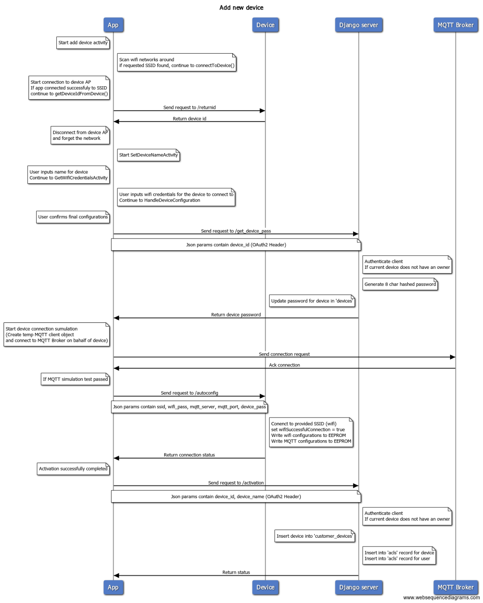

NalkinsCloud-Android
====================
Android Application to control NalkisCloud Project

Getting started
---------------
NalkisCloud Application will allow you to register a new account, add new devices, and control each of the devices.
The applications also has features as account password reset, Forgot password, device removal, task scheduler etc...  

* Please note - This is a dependency project of [NalkisCloud](https://github.com/ArieLevs/NalkinsCloud),
In order for the application to successfully run, it needs to connect to the servers we installed at [NalkisCloud](https://github.com/ArieLevs/NalkinsCloud).

Installation
------------

Download and Install [Android Studio](https://developer.android.com/studio/index.html) IDE, And clone [NalkinsCloud-Android](https://github.com/ArieLevs/NalkinsCloud-Android) to your local machine.  
`git clone PATH TO NalkinsCloud-Android`  
Open cloned project in Android Studio, And import the certificate files created during the automatic installation process of [NalkisCloud](https://github.com/ArieLevs/NalkinsCloud).  
Recommended application to easily copy files from the instance is [WinSCP](https://winscp.net/eng/download.php).  
Both certificate files (of Apache and Mosquitto Server) should be located at users `$HOME` directory,  
Copy `$DOMAIN_NAME.selfsigned.crt` and `mosquitto.$DOMAIN_NAME.crt.bks` to the `assets` directory of Android App.  

Open file `AppConfig.java`, this is the only file you should change in order to tell the application how to connect to the server we just installed.  
Find and change next variables to match your server configurations.  
```
private final static String DOMAIN_NAME = ""; change to Servers IP / Domain Name, for example "nalkins.cloud"
static String SERVER_SSL_CRT_FILE = ""; change to the 'Apache' certificate file name we just copied to our project assets directory for example "nalkins.cloud.selfsigned.crt"  
static String OAUTH_CLIENT_ID = ""; change to 'client_id' from django admin page we saved on stage above  
static String OAUTH_CLIENT_SECRET = ""; change to 'client_secret' from django admin page we saved on stage above 
static String MQTT_SERVER_BKS_FILE = ""; change to the 'Mosquitto' certificate file name we just copied to our project assets directory for example "mosquitto.nalkins.cloud.crt.bks"
static String MQTT_SERVER_BKS_PASSWORD = ""; change to the .BKS password you choose during the automation installation process
```

That's it, `Build` app and install on you android device.

Application workflow examples
-----------------------------

Adding new device

